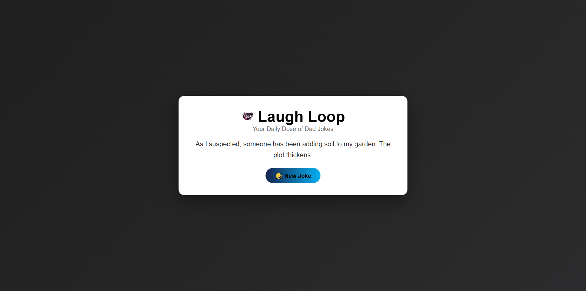
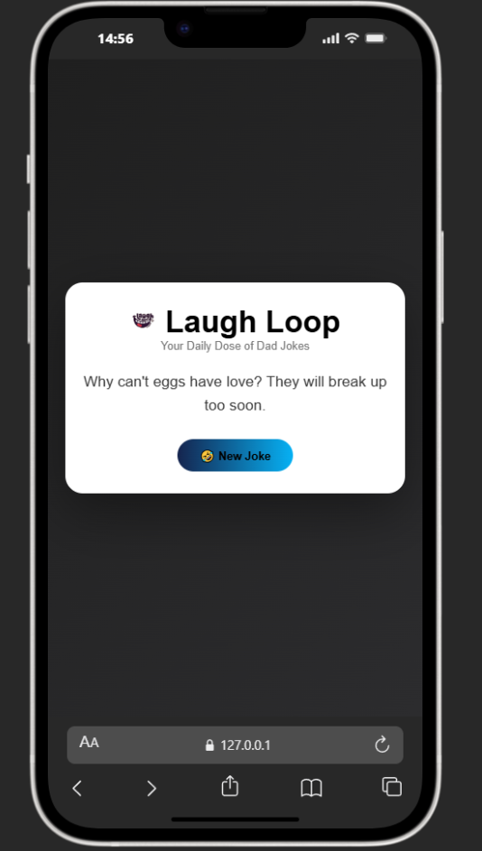

# 😂 LaughLoop – Dad Joke Generator

🚀 **Live Demo:**
🔗[Live Demo](https://gradient.webdevzone.in)

🚀 A fun and lightweight API-based web app that delivers random dad jokes instantly.  
Built to practice **frontend development**, **API handling**, and **modern responsive UI design**.

---

## 📌 Tech Stack

- 🧱 HTML5
- 🎨 CSS3
- ⚙️ JavaScript

---

## ✨ Features

- 😂 Generates random dad jokes instantly
- ⚡ Fast and smooth API integration
- 📱 Fully responsive design (mobile + desktop)
- 🎯 Clean and minimal UI
- 🔄 One-click joke refresh

---

## 🚀 Key Highlights

- ⚡ High Performance – Fast API response handling
- 📱 Responsive UI – Works seamlessly across all devices
- 🎨 Modern Design – Clean layout using Flex-box & Clamp
- 🔌 API Integration – Real-time joke fetching using Fetch API
- 🧠 Beginner Friendly Code – Easy to understand & modify

---

## 📸 Screenshots

> 📌 Add your screenshots here later




---

## 🛠️ Installation

Follow these steps to run the project locally:

```bash
# 1. Clone the repository
git clone https://github.com/webdev-desktop/dad-joke-generator.git

# 2. Go into the project folder
cd dad-joke-generator

# 3. Open index.html in your browser
```

---

## ▶️ Usage

1. Open the app in your browser
2. Click on the **"New Joke"** button
3. Enjoy a random dad joke instantly 😂
4. Click again for more jokes

---

## 🔮 Future Improvements

- 🌙 Dark mode support
- 📋 Copy joke to clipboard
- ❤️ Save favorite jokes
- 🔊 Text-to-speech
- 🌐 Multiple categories

---

## 🤝 Contribution

Contributions are welcome!

```bash
# Fork the repo
# Create a new branch
git checkout -b feature/your-feature

# Commit changes
git commit -m "Add your feature"

# Push to branch
git push origin feature/your-feature
```

Then open a Pull Request 🚀

---

## 👨‍💻 Author

**Apurv**

- [GitHub](https://github.com/webdev-desktop)

---

## 📄 License

This project is licensed under the **MIT License**.

---

## ⭐ Support

If you like this project, don’t forget to star ⭐ the repo and share it!
